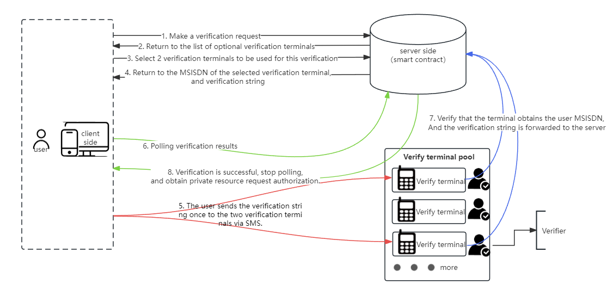

# **
Decentralized SMS Authentication Protocol**
# **
 (3-No Authentication Protocol)
**

## 1. Introduction

The design goal of the decentralized SMS authentication protocol is mainly to solve the problem of user account identity authentication in decentralized applications. It is a protocol framework for the design of decentralized SMS authentication programs.

If traditional email or SMS authentication methods are still used in decentralized applications, their degree of decentralization and service continuity will be seriously questioned. This is because email authentication requires a dedicated outbox address, and SMS authentication requires a SMS access number or sending port that is applied for in a telecommunications company. These resources not only require continuous maintenance, but also require payment; therefore, these tasks also require a centralized human operation to perform. Therefore, such procedures will seriously cause user distrust and contradict the core concept of decentralized applications.

In the context of the birth of Bitcoin, asymmetric private keys were used as a means of permission authentication. This approach is a fully decentralized authentication scheme. Later, in order to facilitate user memory and management, developers derived mnemonic solutions and widely used them in decentralized applications. However, these solutions have risks such as loss, forgetting, and misappropriation of private keys or mnemonics, and can cause users to feel anxious.

The verification method of the decentralized SMS authentication protocol can be designed for the system such that users do not need passwords, private keys, or mnemonics to authenticate their identities, which is why we refer to it as the "3-No Authentication".

## 2. Roles and Nouns

- Server-side

The Server-side is the party that provides services in network applications, generally referring to smart contract applications in blockchain, which are mainly responsible for processing client requests and providing corresponding services, and providing private and exclusive data and resources for users through identity recognition.

- Client

The party receiving services in network applications is mainly responsible for sending requests to the server-side and receiving response data, interacting with users and presenting results. It also accesses private data and resources on behalf of the user's exclusive identity.

- Users

A real person, a service user and an owner of exclusive resources, interacts with the client and server-side through the client, which refers to the main service object of the application.

- Verify the terminal

Refers to the access terminal that provides user authentication.  The terminal consists of a mobile device and a corresponding authentication terminal program installed on it, as well as a SIM card that carries the MSISDN. It is responsible for receiving user SMS authentication information, obtaining the user's sending number, and forwarding it to the server-side.

- Verify terminal pool

The verification terminal pool is composed of verification terminals provided by multiple verifiers.

- Verifier

The individual who has obtained authentication authority in the system is responsible for starting and maintaining the authentication terminal.

## 3. Methods

Firstly, the system allows non-specific users to apply to become validators, and provides a verification terminal application for validators.  This program has access to mobile phone text messages under user authorization.  The validators use an idle smartphone and a dedicated MSISDN, and install and launch the verification terminal program. In this way, when a user needs identity verification, they can send a verification string to this MSISDN access number via SMS. The verification terminal program can detect and read the verification string and sender number in the SMS, and forward it back to the server or smart contract.  By comparing the relevant information through the server program or smart contract, the user identity verification can be completed.

To improve reliability and availability, the system needs to establish a pool of verification terminals to allow more users to become validators.  In this way, the system can provide identity verification access services to users through a round-robin mechanism when they need authentication. Generally, the system needs to design a certain reward strategy to encourage validators to provide long-term and reliable services.

## 4. Agreement Process

## 5. Verifier Incentive Mechanism

As a decentralized open application, we need to attract unspecified users to become validators and provide them with appropriate reward mechanisms to incentivize them to provide reliable and continuous verification services for the system. Depending on the specific business situation, we can also set necessary validator thresholds and exit mechanisms to ensure that there are validators providing verification services for users in the long run and ensure the reliable operation of the system.

## 6. Preventing Verifier Fraud

The fraud of the verifier refers to the behavior of the verifier who forges the MSISDN of others through technical means and forwards it to the server-side to cheat their identity.

In order to prevent the verifier from fraud, the following measures are generally taken:

1. When returning a list of user-selectable authentication terminals in the authentication terminal pool, the MSISDN of the authentication terminal access should be displayed in a non-cleartext or semi-cleartext format. In this way, the authenticator will not be able to select the authentication terminal controlled by themselves in the optional authentication list, thus preventing the authenticator from forging the MSISDN of others through technical means for fraud.
2. Keep multiple verification terminals in sync for verification.  In this way, dishonest verifiers will have difficulty conspiring with other unfamiliar verifiers. This mechanism can further increase the difficulty of dishonest verifiers' operations.

Through the above measures, the occurrence of fraudulent behavior by verifiers can be effectively prevented, protecting the security and reliability of the system.

## 7. Reliability Score

In order to ensure the availability and reliability of authentication, we can establish an appropriate scoring mechanism to incentivize authenticators to maintain high-quality networks and power for authentication terminals. By collecting real-time information on the mobile signal quality and network latency of the terminal, we can form a real-time score. Users can choose higher-quality authentication terminals based on this score, which further promotes authenticators to better maintain the availability and reliability of authentication terminals. This not only ensures the smoothness of user authentication, but also incentivizes authenticators to provide better services.

## 8. Process Self-Motivation Measures

When the system first starts to operate and there are no users to join as validators, the system requires a centralized access number to provide verification access services for early users. Later, when the number of validators reaches a certain level, the access number can be automatically removed.

   

$$
\begin{matrix}
Delta&Core&Developer \\
\qquad November & 2023
\end{matrix}
$$